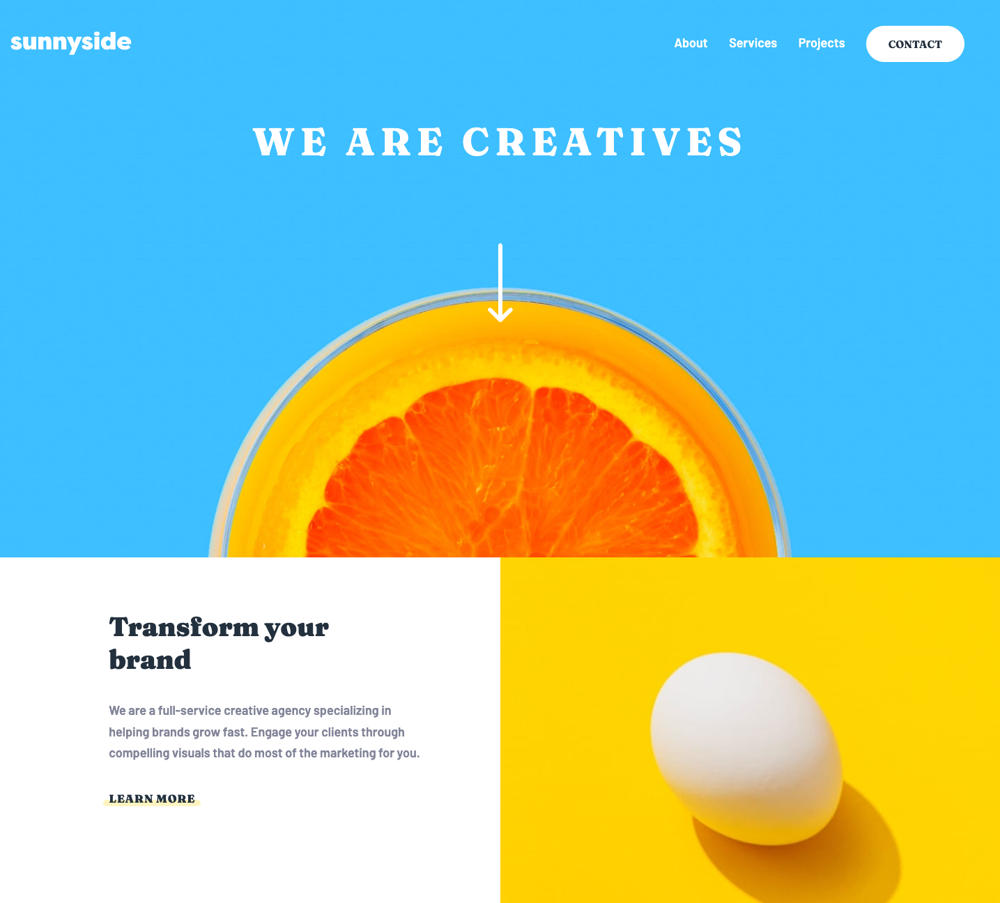

# Frontend Mentor - Sunnyside agency landing page solution

This is a solution to the [Sunnyside agency landing page challenge on Frontend Mentor](https://www.frontendmentor.io/challenges/sunnyside-agency-landing-page-7yVs3B6ef). Frontend Mentor challenges help you improve your coding skills by building realistic projects.

## Table of contents

- [Overview](#overview)
  - [The challenge](#the-challenge)
  - [Screenshot](#screenshot)
  - [Links](#links)
- [My process](#my-process)
  - [Built with](#built-with)
  - [What I learned](#what-i-learned)
  - [Useful resources](#useful-resources)
- [Author](#author)

## Overview

### The challenge

Users should be able to:

- View the optimal layout for the site depending on their device's screen size
- See hover states for all interactive elements on the page

### Screenshot

Mobile


Desktop


### Links

- Solution URL: [https://github.com/kennbach/sunnyside-landing-page](https://github.com/kennbach/sunnyside-landing-page)
- Live Site URL: [https://kennbach.github.io/sunnyside-landing-page/](https://kennbach.github.io/sunnyside-landing-page/)

## My process

### Built with

- Semantic HTML5 markup
- CSS
- CSS Variables
- CSS Grid
- Vanilla JavaScript
- Mobile-First workflow
- Accessibility Aware

### What I learned

I used what I had learned in "The Shapes of CSS" article listed below to create the top-right point of the mobile navigation menu on this project. Quick and easy.

I also learned a great trick to center an element. I had tried methods similar to the code below but never got it right until I learned to apply that final line... `transform: translate(-50%, -50%);`. I found this in the "Absolute Centering in CSS" article I listed below.

```
.parent{
  position: relative;
}
.child{
  position: absolute;
  top: 50%;
  left: 50%;
  transform: translate(-50%, -50%);
}
```

### Useful resources

- [The Shapes of CSS](https://css-tricks.com/the-shapes-of-css/#aa-triangle-bottom-right-shape) CSS is capable of making all sorts of shapes.

- [Absolute Centering in CSS](https://medium.com/front-end-weekly/absolute-centering-in-css-ea3a9d0ad72e) A quick read on how to center an element using either position, the viewport unit, flexbox, or grid.

## Author

- Github - [kennbach](https://github.com/kennbach)
- Frontend Mentor - [@kennbach](https://www.frontendmentor.io/profile/kennbach)
